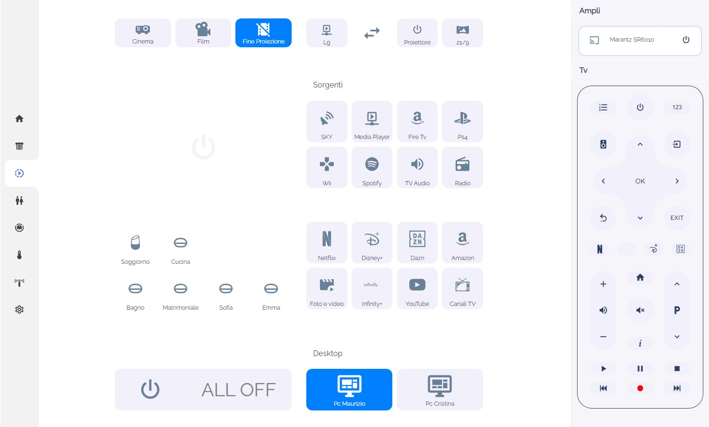

# LG WebOS Image Source Card
this card display le source image logo

[](https://github.com/hacs/integration)
[](https://www.buymeacoffee.com/madmicio)


click to watch video:
[](https://www.youtube.com/watch?v=rGw0AoCuD5o)


## hacs Card install
1. add madmicio/LG-WebOS-Image-Source-Card as custom reposity

2. Find and install `LG WebOS Image Source Card` plugin

3. Add a reference  inside your resources config:

  ```yaml
resources:
url: /hacsfiles/LG-WebOS-Image-Source-Card/webos-source-image.js
type: module
```


### Manual install

1. Download and copy `webos-source-image.js` from (https://github.com/madmicio/LG-WebOS-Image-Source-Card) into your custom components  directory.

2. Add a reference `webos-source-image.js` inside your resources config:

  ```yaml
  resources:
    - url: /local/"your_directory"/webos-source-image.js
      type: module
  ```

### Main Options
| Name | Type | Default | Supported options | Description |
| -------------- | ----------- | ------------ | ------------------------------------------------ | --------------------------------------------------------------------------------------------------------------------------------------------------------------------------------------------------------------------------------------------------------------------------------------------------------------------------------------------- |
| `type` | string | **Required** | 'custom:webos-source-image' | Type of the card |
| `entity` | string | **Required** |  | tv entity |
| `hdmi_list` | string | **Option** |  | list to map hdmi inputs |

## hdmi_list options
| Name | Type | Default | Supported options | Description |
| -------------- | ----------- | ------------ | ------------------------------------------------ | --------------------------------------------------------------------------------------------------------------------------------------------------------------------------------------------------------------------------------------------------------------------------------------------------------------------------------------------- |
| `hdmi` | string | **Required** |  | the exact name of the HDMI input |
| `mediaplayer` | string | **Option** |  | mediaplayer entity connected to the HDMI input |

the card displays a png image. the file path is reconstructed from the card according to the TV's media title or source content.
if source is equal to hdmi: of the hdmi_list then the card will display the source of the mediaplayer associated with hdmi:
if mediaplayer is not configured but only hdmi: xxxx is present then the card will display the xxxx.png file

when the tv is off but one of the media players in the hdmi_list is on, the card will display the file linked to the source attribute of the first hdmi: entity in the list.
then configure the hdmi_list putting the mediaplayer in first place which, when the TV is off, must have priority over the others


# NB:
the card needs image files to work, but if you intend to use it, it means that you have already downloaded and uploaded the images to your Home Assistant folder

 
[find the procedure for the images here]([https://github.com/PiotrMachowski](https://github.com/madmicio/LG-WebOS-Remote-Control))

  ```yaml
entity: media_player.lg_webos_tv_oled55c8pla
hdmi_list:
  - hdmi: HDMI 1
    mediaplayer: media_player.proiettore
  - hdmi: Marantz
    mediaplayer: media_player.marantz_sr6010
  - hdmi: HDMI 3
    mediaplayer: media_player.soggiorno
```
